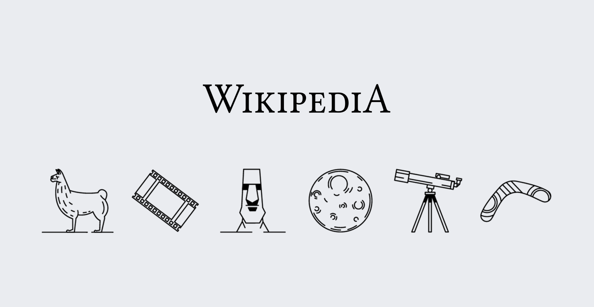
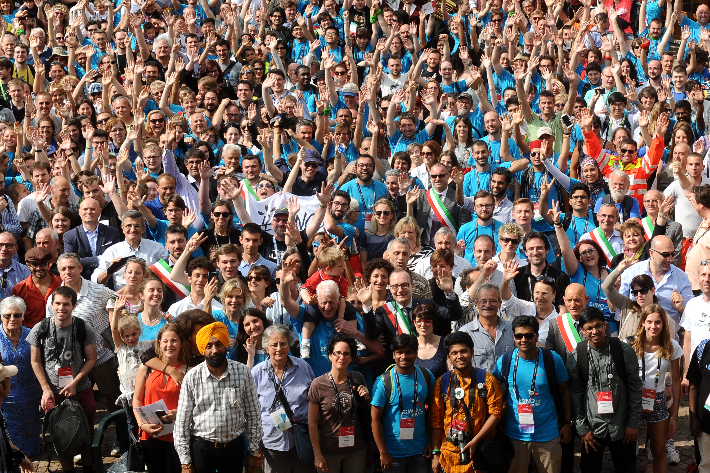
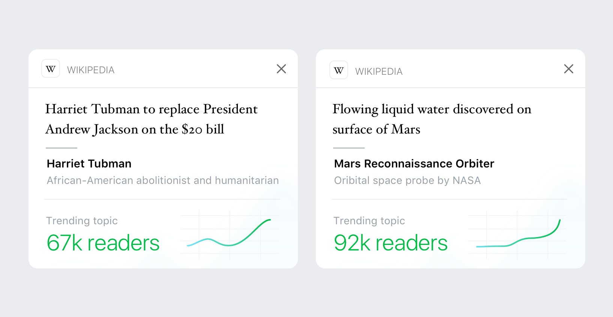
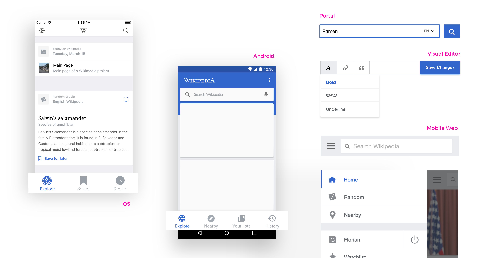

When making design decisions, we need to choose among possible solutions. Design principles help to decide what to prioritize for.

Our identified design principles:

*   [This is for everyone](#this-is-for-everyone)
*   [Content first](#content-first)
*   [Open to collaboration](#open-to-collaboration)
*   [Trustworthy yet joyful](#trustworthy-yet-joyful)
*   [Design for consistency](#design-for-consistency)

They are captured below. Find further [details at Design on Wikimedia Meta-Wiki](https://meta.wikimedia.org/wiki/Design).

## This is for everyone

We aim to support a very diverse audience as a core part of our mission. It's a priority to help users overcome the different barriers between them and the knowledge our projects provide. These barriers include accessibility, language, device capabilities, network, and peoples’ technical expertise — among others. When improving the experience for a given group of people, we need to make sure we are not increasing the barriers for others.

## Content first

People come to Wikimedia projects for their content. Therefore our solutions should help to facilitate its creation, consumption and sharing — without getting in the way. Our content (facts, images, quotes, etc.) is our most representative element, and needs to be emphasized in our solutions.

## Open to collaboration

Our projects are collaborative. Discussion and sharing are key factors to consider. To support diversity and a global mission, our solutions need to provide room for extension and customization to particular needs and different perspectives.

[Group photo](https://commons.wikimedia.org/wiki/File:Wikimania_2016_-_group_photo_03.jpg) during Wikimania 2016 in Esino Lario with volunteers attending from all around the world.

## Trustworthy yet joyful

Wikimedia projects provide reliable educational knowledge. At the same time, our projects are a source of entertainment and satisfy human curiosity. This requires us to find the right balance: we need to convey trust with our solutions but still remain entertaining and fresh.

## Design for consistency

In order to facilitate understanding it is important to rely on familiar concepts. Keeping consistency within our designs, and maintaining common patterns helps people relate quickly and orientate easily.

