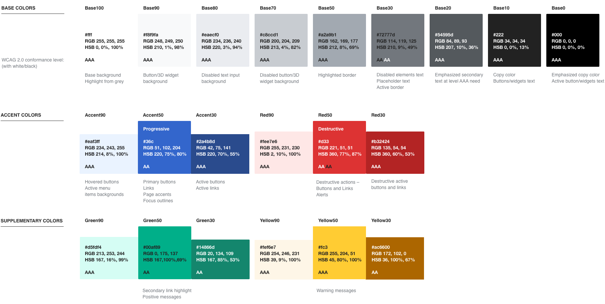

The [color palette](https://phabricator.wikimedia.org/M82) represents our character and brings a hint of freshness to our products.

Because content readability for everyone is our main goal, we have made accessibility considerations a top priority. Each color in the palette indicates its [WCAG](https://www.w3.org/WAI/intro/wcag "Web Content Accessibility Guidelines 2.0") conformance level (“AA” or “AAA”). This level is based on a color's contrast against white or black.

## Base colors

Base colors define the content surface and the main color for content. Different shades of paper and ink are useful to emphasize or de-emphasize different content areas.

Base colors range from pure white (Base100) to true black (Base0). Intermediate shades of gray include a tint of blue for greater harmony with our accent colors.

When applying text on a surface, you need to [check the color contrast](http://webaim.org/resources/contrastchecker/) between the text and the background: 

-   Base100...50 are safe text colors for a black surface.
-   Base30...0 are safe text colors for a white surface.


  
  
  
  
  
  
  
  
  


## Accent colors

Accent colors are used to emphasize actions and to highlight key information. Blue is a natural choice in our context, where it has been the default color used for links and conveys the idea of action.

There are three shades provided for when you need a lighter (Accent90), regular (Accent50) or a darker (Accent10) version of blue.

Accent50 is suitable to use for text and as background. When used for link text, this color provides sufficient contrast with black text. When used as background, it provides sufficient contrast with white text.


  
  
  


## Utility colors

Utility colors are another type of accent color. Common meanings are associated with them.
We use shades of red, green, and yellow as utility colors.


  
  
  
  
  
  
  
  
  


## Additional colors

Some use cases, such as charts and data visualization, may need a broader color palette. Aim for level AA contrast (4.5:1) when extending the default palette. Make sure to test how these colors are perceived at different color vision deficiency conditions.
