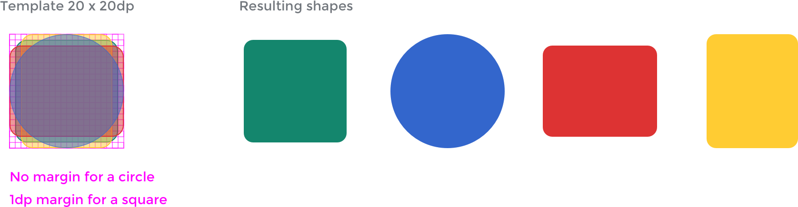

Icons help convey a message visually.

## Principles

Wikimedia icons should be simple and neutral. [\[1\]](#References)

**Reduce to the essential form.** Pare down details to convey the icon in as simple a shape as possible. The core idea of the design should be clearly conveyed, whilst remaining easily discernible even at smaller sizes. For example, a keyboard should _not_ be represented by showing all 100+ keys that are in the real object, since this would make it unrecognizable.

**Universal rather than culturally-specific.** Symbols and ideas represented in iconography should be known to a global audience. For example, do not use a dollar sign “$” to represent money, or a four-leaf clover to represent luck.

**Avoid textual content within the icon.** Besides loss of universal recognition when including a specific language element, it may add unnecessary complexity. However, there are exceptions for icons directly related to language/text (for example, the icon for language switching).

**Abstract forms or concrete objects.** Take consideration when deciding to use abstract or concrete objects in designing an icon. In some cases, concrete objects are preferred, such as using a die to convey “random” or a bell to convey an alert. In other cases, abstract symbols may be preferable, such as using an question mark “?” for help rather than a life preserver, or an ellipsis “…” to indicate “more”.

**Neutral point of view.** Avoid concepts such as gestures, animals, religion, humor, ethnicity, and gender.

## Visual style

Characteristics of a WikimediaUI icon:

*   **Monochromatic.** Solid color icons.
*   **Geometric.** Comprised of simple and ideally symmetrical geometric shapes. Symmetrical icons tend to be more universally applicable (an open book rather than a closed book with binding on left or right side).
*   **Front-facing.** Icons are flat and front facing, not multi-dimensional.
*   **20 x 20 dp default canvas.** WikimediaUI icons are put on a 20 x 20 device-independent pixel (\`dp\`)[\[2\]](#References) canvas per default.
*   **Rounded corners.** Corners are rounded to make shapes more friendly and welcoming. For the default canvas use 2 dp rounded corners. Note that rounded corners are applied only on the exterior of an icon shape, not interior corners.
*   **Medium thick stroke.** Lines and outline should be visible at smaller sizes without effort, for the default icon canvas use a 2 dp thick stroke as standard. Endpoints of lines are square in keeping with simple geometric shapes.
*   **Diagonal cross-out lines.** For icons that appear to be crossed-out, the cross-out line starts from the top-left of the icon and continues at a 45 degree angle to the bottom right (similar to a backslash “\\”).

### Guidelines for creating icons

Icons follow a template. The default canvas is 20 x 20 dp. In order to allow for optical adjustments, a different margin is applied depending on the shape of the icon.

Different shapes have a different perceived size. A 1 dp margin for square-shaped icon is used whilst a circle uses the full 20 x 20 dp canvas available to reach a similar perceived size.

**Black icons**
Use black ([Base0](visual-style_colors.html)) on a transparent background as the boldest representation of an icon. The color can be changed when the icon is used (preferably done automatically by software).

**Filled areas with no stroke outlines**
For example, a donut icon is a filled circle with a hole in the middle rather than an unfilled circle with a thick stroke outline.

**Pixel-fitting**
Ensure icon shape edges are fit to pixels as closely as possible so that shapes are not distorted or fuzzy.

**Right-to-left (RTL) and left-to-right (LTR) considerations**
In cases where the icon is non-symmetrical, consider whether RTL or LTR directionality changes the meaning conveyed before creating the alternate direction variation. For example, the play button is universally seen as a triangle with a straight left edge and does not require two variations, whilst a bullet list icon would show the “bullets” in the list on the right or left side depending on whether it is shown in RTL or LTR language context.

### Usage

**Clearance on touch devices**
When using icons consider the size of their target area. Even if icons are presented at a smaller size, make sure that the associated active area is at least 44 x 44 dp. Otherwise users may fail to hit the active area, not getting the expected result.

**Adapt and remix**
Our icons are free licensed under CC BY 4.0.
The simple style and guidelines make it easy to reuse or adapt existing freely licensed icons that you can find on other repos such as [Material icons](https://material.io/icons/) [\[3\]](#References) or the [Noun project](https://thenounproject.com/) [\[4\]](#References). You are welcome to use existing icons that align to the proposed style instead of reinventing the wheel icon.

### Resources

The [OOUI icon repository](https://doc.wikimedia.org/oojs-ui/master/demos/?page=icons&theme=wikimediaui&direction=ltr&platform=desktop#icons-mediawiki-ltr) provides a list of the currently available icons.

### References

1.  Thanks to volunteer contributor [@SamanthaNguyen](https://phabricator.wikimedia.org/p/SamanthaNguyen/) for many suggestions on the “Principles” section in icons on [Phabricator task T155684](https://phabricator.wikimedia.org/T155684).
2.  1 dp equals 1 px in CSS at 100% zoom level and 1x device. [Device-independent pixel on English Wikipedia](https://en.wikipedia.org/wiki/Device-independent_pixel).
3.  Google offers a [Material icons overview and guide to use](https://material.io/guidelines/style/icons.html).
4.  The Noun Project provides curated [icon sets that are either Creative Commons Attribution (CC BY) or Public Domain (PD)](https://thenounproject.zendesk.com/hc/en-us/articles/200509798-What-licenses-do-you-use-).
