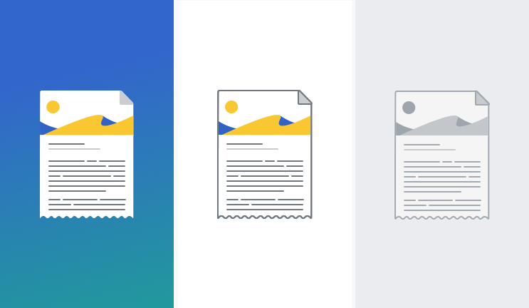

### Illustration style

**Colored backgrounds**
Illustrations that appear on a colored background should not include an outline stroke. Elements inside of the illustration should also not contain an outline stroke. Any lines inside of the illustration should have a weight of 2 dp. The illustration can utilize any of the colors available in the Style Guide excluding Base0.

**White background**
Illustrations that appear on a white background should include a 2 dp outline stroke in Base50. Elements inside of the illustration can contain an outline stroke, this stroke should also be a 2 dp stroke in Base50. The illustration can utilize any of the colors available in the Style Guide excluding Base0.

**Grey scale**
Grey scale illustrations (for use in empty states) should include a 2 dp outline stroke in Base60. Elements inside of the illustration can contain an outline stroke, this stroke should also be a 2 dp stroke in Base60. The illustration should only include base colors excluding Base0.

### Using illustrations

Illustrations should be used as a supporting element alongside text and should never appear alone. Illustrations should be relevant and context-aware of their surroundings, do not include illustrations simply for decoration. Empty states, onboarding, or modals containing messaging are the primary use cases for utilizing illustrations. Utilize the appropriate illustration style depending on the background that the illustration will be presented on.

Illustrations should never appear pixelated. Test the resolution of your illustration for the specific the ratios you will be using it in.

### Creating illustrations

Illustrations should fit within a 200 dp by 200 dp square. Some illustrations may need to be taller than they are wide (and visa versa) but overall illustrations should look balanced within their 200 dp boundary.

Illustrations must adhere to the colors outlined in this Style Guide, however no illustrations should use Base0. Illustrations may include transparent elements or cut outs, however no elements may be depicted as semi-transparent or with a reduced opacity. All elements should either be transparent or displayed at 100% opacity.

When designing a new illustration, focus on legibility. Illustrations consist of a single element or focused composition. Illustrations should be simple, clear, universal and memorable.

Illustrations should be simple. They use monochromatic vector-based shapes with the following properties:

*   Filled areas. Shapes are defined by filled areas as opposed to outlines.
*   Rounded corners. Corners are slightly rounded (2 dp) to make shapes more friendly and welcoming, but not too much to look goofy.
*   2 dp outline stroke, except for illustrations that appear on colored backgrounds.

Illustrations must adhere to the colors outlined in this Style Guide, however no illustrations should use Base0. As a general recommendation, an illustration should utilize no more than 3 accent or supplementary colors (eg. Blue50, Red50, Green50 and Yellow50) to avoid visual complexity. Additionally, special care should be taken when using reds with greens or blues in the same composition. Users with red-green color blindness may have difficulty differentiating between red and green elements, especially if they are overlapping. Red and blue elements should also be treated with care so as to avoid the visual illusion of [chromostereopsis](https://en.wikipedia.org/wiki/Chromostereopsis) . Illustrations may include transparent elements or cut outs, however all elements should be shown as either 0 or 100% opacity.
