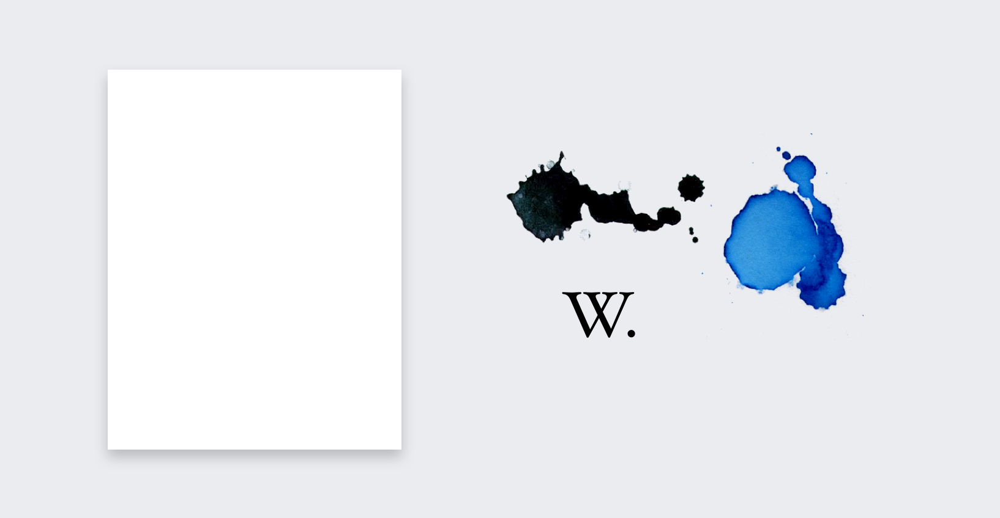

Wikimedia-Projekte sind mit Lernen, Redaktion und Büchern verbunden. Sie sind neutral und transparent. Es geht um Lesen und Schreiben.

Wikipedia ist unser prominentestes Projekt.
Es ist eine Enzyklopädie. Es ist eine moderne Enzyklopädie. Wir haben eine gewisse Wahrnehmung der visuellen Identität, wenn wir über Enzyklopädien sprechen. Eine Identität, die Weisheit widerspiegelt. Zur gleichen Zeit haben traditionelle Enzyklopädien ein datiertes Aussehen und Gefühl. Dies ist auch der große Unterschied zwischen traditionellem Wissensaustausch und Wikipedia. Wikipedia entwickelt sich ständig weiter und wir müssen das in sein Erscheinungsbild integrieren.

Papier war das größte Medium zur Verbreitung von Wissen. Heute sind es Computer. Wir haben Werte geliehen, die an gedruckte Medien gebunden sind. Werte wie Vertrauenswürdigkeit und akademische Objektivität.

Wir beginnen mit grundlegenden Elementen wie Papier und Tinte und erweitern sie dann weiter, um den Bedürfnissen unseres visuellen Charakters zu entsprechen.

! [Blatt Papier wirft Schatten auf den Hintergrund](principles-paper-shadow.png)

Papier wirft subtile Schatten auf eine Grundfläche. Papier hat aufgrund seiner organischen Beschaffenheit leicht abgerundete Ecken.

! [Beispiel-Screenshot eines Wikipedia-Artikels über Dieter Rams](principles-content-chrome.png)

Wir folgen zuerst unseren inhaltlichen Gestaltungsprinzipien, Inhalt dem Chrom.

> Chrome ist das visuelle Gestaltungselement, das den Benutzern Informationen über den Inhalt des Bildschirms zur Verfügung stellt oder ihnen Befehle erteilt (anstatt Teil dieses Inhalts zu sein). [Browser und GUI Chrome](https://www.nngroup.com/articles/browser-and-gui-chrome/), Nielsen 2012

Inhalt geht auf Papier, Chrom bleibt auf der Basisschicht.

! [Farb- und Schriftmuster aus unserer Richtlinie] (principles-color-type.png)

Unsere Farbauswahl ist von Schwarz, Weiß und Tintenblau inspiriert. Typografie hat Wurzeln in traditionellen Schriften.

! [Vergleich einiger unserer geführten Attribute mit "Old Medium" der New York Times](Prinzips-style-tile.png)

Es ist eine ungewöhnliche Mischung aus neuen und alten Medien. Fröhlich und dennoch vertrauenswürdig.
Die Themen in diesem Abschnitt sind Untersuchungen dieser Ideen.
