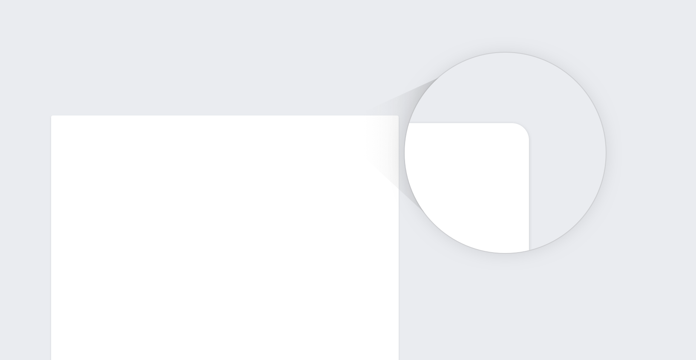

Wikimedia projects are associated with learning, editorship, and books. They are neutral and transparent. They are about reading and writing.

Wikipedia – our most prominent project – is a modern encyclopedia with its roots in traditional knowledge sharing. Our design choices acknowledge the past, and look ahead to the future.

Paper was once the medium for spreading knowledge. Our encyclopedic knowledge was stored in the pages of leatherbound books. Today, we find it online. We access it from our computers, smartphones, and tablets.

We take our design cues from printed media, reflecting values like trustworthiness and academical objectivity.

We start with basic elements like paper and ink, then extend it further to match the needs of our visual character.

Paper casts subtle shadows onto a base surface. Paper has slightly rounded corners due to its organic nature.

We follow our design principles of content first, content precedes chrome.

> Chrome is the visual design elements that give users information about or commands to operate on the screen's content (as opposed to being part of that content).
-- <cite>[Browser and GUI Chrome](https://www.nngroup.com/articles/browser-and-gui-chrome/), Nielsen 2012 </cite>

Content goes on paper, chrome stays on the base layer.

Our color choices are inspired by ink on paper: black, white, and blue. Our typography reflects traditional print typefaces.

Our goal is to invoke the old and the new, to evoke joy and trust.
