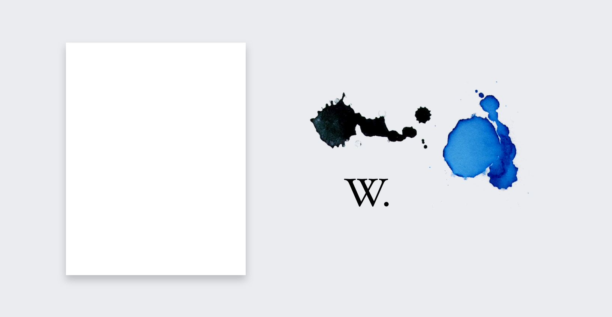

Wikimedia projects are associated with learning, editorship, and books. They are neutral and transparent. They are about reading and writing.

Wikipedia is our most prominent project.
It's an encyclopedia. It's a modern encyclopedia. We have a certain perception of visual identity when we talk about encyclopedias. An identity which reflects wisdom. At the same time, traditional encyclopedias have a dated look and feel. This is also the big difference between traditional knowledge sharing and Wikipedia. Wikipedia is continuously evolving and we need to incorporate that into its look and feel.

Paper was the largest medium for spreading knowledge. Today it is computers. We borrowed values that are tied to printed media. Values like trustworthiness and academical objectivity.

We start with basic elements like paper and ink, then extend it further to match the needs of our visual character.

Paper casts subtle shadows onto a base surface. Paper has slightly rounded corners due to its organic nature.

We follow our design principles of content first, content precedes chrome.

> Chrome is the visual design elements that give users information about or commands to operate on the screen's content (as opposed to being part of that content). [Browser and GUI Chrome](https://www.nngroup.com/articles/browser-and-gui-chrome/), Nielsen 2012

Content goes on paper, chrome stays on the base layer.

Our color choices are inspired by black, white, and ink blue. Typography has roots in traditional typefaces.

It is an uncommon mix of new and old media. Joyful yet trustworthy.
The topics in this section are examinations of these ideas.
